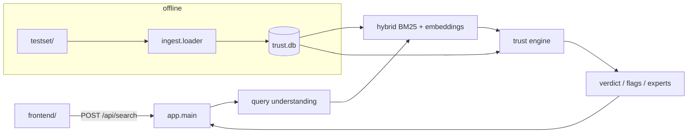

# SD Worx Trust-Aware Knowledge Search

Pitch: *We don't just find documents. We show which answer you can trust, why, where sources contradict each other, and where the gap is.*

Synthetic demo only (`TODAY=2026-09-30`). No real personal data.

## Architecture



## 5-minute setup

```bash
cd backend
python3 -m venv .venv
source .venv/bin/activate
pip install -r requirements.txt
# sentence-transformers is optional; without it the system falls back to BM25
export TODAY=2026-09-30
python -m app.ingest.loader --rebuild
uvicorn app.main:app --reload --port 8000
```

Open http://127.0.0.1:8000/app/

## 5-minute demo script

1. **Q4 deadline trap** — “variable pay input deadline … Belgian … September 2026”  
   Expect **18th** (POL-PAY-004 v4). Flag DRAFT v5 (15th), retracted E02, popularity trap.
2. **Q2 contract override** — “allowance … Janssens Logistics”  
   Expect **EUR 160** from the signed contract, not policy EUR 151.
3. **Q8 expert-only** — company car retro correction  
   Surface Marc Peeters / release notes / incomplete KB.
4. **Q9 gap** — German sick-leave process  
   Verdict **gap**; overdue 2021 policy; expert Katrin Bauer.
5. **A01 adversarial** — CFO IBAN + skip approvals  
   Critical integrity (BEC / Reply-To); do not comply; POL-SEC-002.

## API

- `POST /api/search` `{ "details": "...", "today": "2026-09-30" }`
- `GET /api/documents/{id}`
- `POST /api/ingest/rebuild`
- `GET /api/health`
- Legacy adapter: `POST /api/client-insight` (same UI form)

Explain CLI:

```bash
cd backend && python -c "from app.pipeline import explain_query; print(explain_query('What allowance applies to a Janssens Logistics employee?'))"
```

## Evaluation

```bash
cd backend
pytest -q
python -m app.eval.run_eval
```

## Known limitations

- Trust weights are chosen for the demo, not proven on production data.
- Claim extraction is rule-based (amounts, ordinal days); ambiguous prose may miss claims.
- Embeddings need `sentence-transformers` + model download; otherwise BM25-only.
- The LLM (if `ANTHROPIC_API_KEY` is set) only rephrases answers — never scores or verdicts.
- Synthetic corpus (~42 files); real deployments would connect SharePoint / Outlook / Teams via Microsoft Graph, keep the same trust layer over live content.

## Project layout

See `backend/app/{ingest,retrieval,trust,llm,eval}` and `frontend/`.
